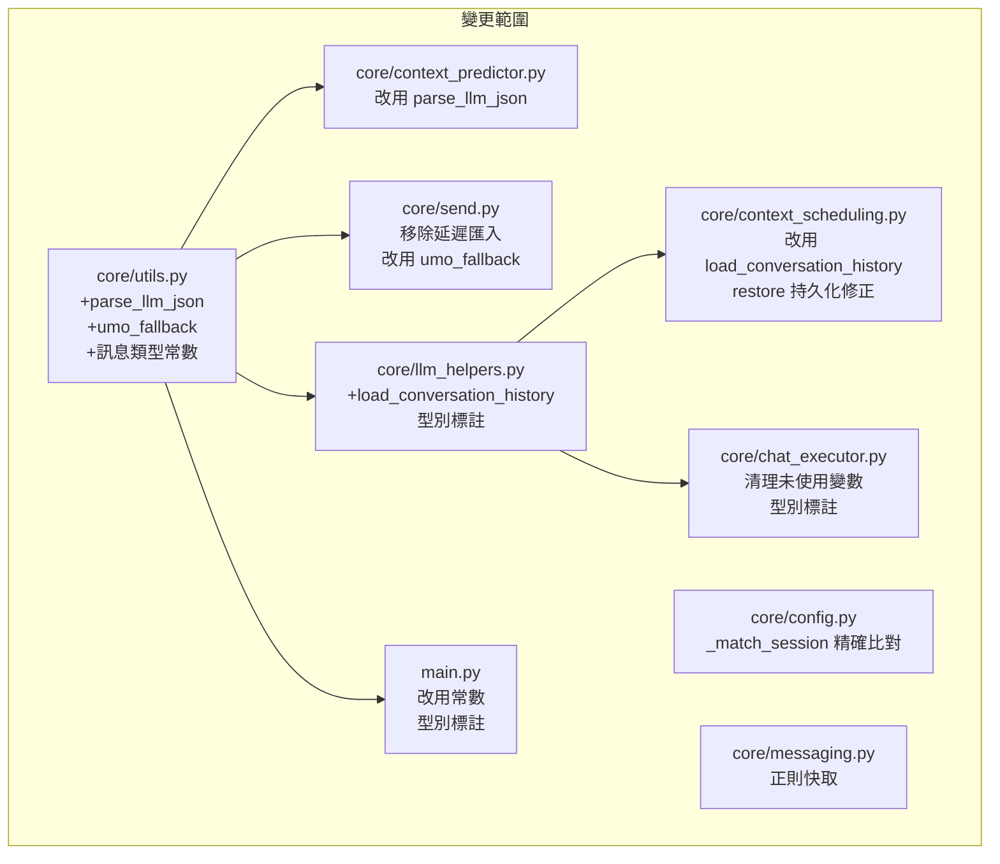

# 設計文件：程式碼品質重構

## 概述

本設計文件描述如何對 AstrBot 主動訊息插件進行全面的程式碼品質重構。所有變更嚴格遵守「行為不變」原則——僅改善程式碼結構、型別安全性、可維護性與一致性，不新增或修改任何功能邏輯。

重構涵蓋 10 個需求，可歸納為四大類：
1. **消除重複**（需求 2、3、4）：抽取共用的 JSON 解析、UMO 容錯、對話歷史載入邏輯
2. **型別與靜態分析**（需求 1、7）：補齊型別標註、清理未使用變數
3. **效能與最佳實踐**（需求 5、6）：修正模組級匯入、快取正則表達式
4. **正確性修復**（需求 8、9、10）：持久化一致性、session_id 精確比對、統一錯誤處理

## 架構

本次重構不改變現有的模組架構。所有變更都在既有檔案內進行，僅在 `core/utils.py` 中新增少量共用工具函數。



### 設計原則

- **最小變更原則**：每個重構點只修改必要的程式碼，避免連鎖重構
- **向下相容**：所有公開 API（`__init__.py` 中匯出的函數）簽名不變
- **相對匯入**：所有 core 模組間的匯入使用相對匯入（`from .utils import ...`）
- **TYPE_CHECKING 守衛**：重型別（如 `AstrBotConfig`、`Context`）僅在型別檢查時匯入

## 元件與介面

### 元件 1：通用 JSON 解析器（需求 2）

**檔案**：`core/utils.py`

將 `context_predictor.py` 中 `_parse_json_response` 和 `_parse_json_array_response` 的共用邏輯抽取為單一通用函數。

```python
def parse_llm_json(
    text: str,
    *,
    expect_type: type[dict] | type[list] | None = None,
    log_tag: str = _LOG_TAG,
) -> dict | list | None:
    """從 LLM 回應文字中穩健地解析 JSON。

    處理 markdown 程式碼區塊、fallback 正則搜尋。
    expect_type 為 dict 時只接受物件，為 list 時只接受陣列，
    為 None 時接受任意 JSON 值。
    """
```

**重構方式**：
- `_parse_json_response` → `parse_llm_json(text, expect_type=dict)`
- `_parse_json_array_response` → `parse_llm_json(text, expect_type=list)`
- 原函數保留為薄包裝（thin wrapper），避免破壞內部呼叫

### 元件 2：UMO 容錯包裝器（需求 3）

**檔案**：`core/utils.py`

```python
def with_umo_fallback(
    fn: Callable[..., T],
    session_id: str,
    *args: Any,
    **kwargs: Any,
) -> T:
    """包裝同步函數，自動處理 UMO ValueError 並以標準三段式格式重試。"""
```

```python
async def async_with_umo_fallback(
    fn: Callable[..., Awaitable[T]],
    session_id: str,
    *args: Any,
    **kwargs: Any,
) -> T:
    """包裝非同步函數，自動處理 UMO ValueError 並以標準三段式格式重試。"""
```

**重構方式**：
- `llm_helpers.py` 的 `safe_prepare_llm_request` 改用 `async_with_umo_fallback`
- `send.py` 的 `get_tts_provider` 改用 `with_umo_fallback`
- 容錯邏輯：捕獲 `ValueError`，檢查訊息是否包含 `"too many values"` 或 `"expected 3"`，若是則用 `parse_session_id` 重組為標準格式重試

### 元件 3：共用對話歷史載入器（需求 4）

**檔案**：`core/llm_helpers.py`

```python
async def load_conversation_history(
    context: Context,
    session_id: str,
) -> tuple[str, list]:
    """取得當前對話的 conv_id 與已解析的歷史記錄。

    Returns:
        (conv_id, history)；無法取得時回傳 ("", [])。
    """
```

**重構方式**：
- 從 `prepare_llm_request` 中抽取「取得 conversation → 解析 history JSON」的邏輯
- `context_scheduling.py` 的 `get_history_for_prediction` 改為呼叫此函數
- 解析邏輯：`isinstance(history, str)` → `json.loads`，失敗回傳空列表

### 元件 4：訊息類型常數（需求 5）

**檔案**：`core/utils.py`

```python
# 訊息類型常數
MSG_TYPE_FRIEND = "FriendMessage"
MSG_TYPE_GROUP = "GroupMessage"
MSG_TYPE_KEYWORD_FRIEND = "Friend"
MSG_TYPE_KEYWORD_GROUP = "Group"
```

**影響範圍**：
- `main.py`：`_setup_auto_trigger_for_session_config` 中的 `"FriendMessage"` / `"GroupMessage"` 字面量
- `core/utils.py`：`parse_session_id` 中的預設值 `"FriendMessage"`
- `core/messaging.py`：`"Group" in msg_type_str` 改為使用常數
- `core/config.py`：`"Group" in msg_type` 改為使用常數

### 元件 5：正則表達式快取（需求 6）

**檔案**：`core/messaging.py`

```python
@functools.lru_cache(maxsize=32)
def _compile_split_regex(pattern: str) -> re.Pattern[str] | None:
    """快取編譯使用者自訂的分段正則。無效模式回傳 None。"""
    try:
        return re.compile(pattern)
    except re.error as e:
        logger.warning(f"{_LOG_TAG} 分段正則錯誤: {e}，回退整段發送。")
        return None
```

**重構方式**：
- `split_text` 中的 `re.compile(pattern_str)` 改為呼叫 `_compile_split_regex(pattern_str)`
- 使用 `lru_cache(maxsize=32)` 快取最近 32 個不同的正則模式
- 無效模式回傳 `None`，`split_text` 檢測到 `None` 時回退到預設正則

### 元件 6：session_id 精確比對（需求 9）

**檔案**：`core/config.py`

**現有邏輯**（有缺陷）：
```python
if cid and (target_id == cid or target_id.endswith(f":{cid}")):
```

**修正後**：
```python
if cid and (target_id == cid or target_id.endswith(f":{cid}")) and (
    target_id == cid or f":{cid}" in f":{target_id}"
):
```

更精確的做法是改為：
```python
if cid and _is_target_match(target_id, cid):
```

```python
def _is_target_match(target_id: str, config_id: str) -> bool:
    """精確比對 target_id 與配置中的 session_id。

    支援完全匹配或以分隔符 ':' 為邊界的尾部匹配，
    避免 '123' 誤匹配 '4123'。
    """
    if target_id == config_id:
        return True
    # 帶分隔符的尾部匹配：確保 cid 前面是 ':'
    return target_id.endswith(f":{config_id}")
```

**分析**：原始的 `endswith(f":{cid}")` 實際上已經是帶分隔符的匹配（因為前綴有 `:`），所以 `"4123"` 不會匹配 `":123"`。但 `target_id == cid` 的分支在 `target_id` 為純數字 ID 時是正確的精確匹配。真正的問題在於：若 `target_id` 本身就是完整的 UMO 格式（如 `platform:FriendMessage:4123`），而 `cid` 為 `"123"`，則 `endswith(":123")` 會誤匹配。修正方式是確保 `:cid` 前面的字元確實是分隔符位置。

修正後的 `_is_target_match`：
```python
def _is_target_match(target_id: str, config_id: str) -> bool:
    """精確比對 target_id 與配置中的 session_id。"""
    return target_id == config_id or target_id.endswith(f":{config_id}")
```

等等——重新審視程式碼，`_match_session` 接收的 `target_id` 是從 `parse_session_id` 解析出的第三段（純目標 ID），而 `cid` 是配置中的 `session_id`。所以 `target_id` 通常是純數字如 `"123456"`，而 `cid` 也是純數字。在這種情況下，`target_id.endswith(f":{cid}")` 永遠不會匹配（因為純數字不含 `:`）。

真正的風險場景是：`target_id = "4123"`, `cid = "123"`, `target_id == cid` 為 False, `target_id.endswith(":123")` 也為 False。所以原始邏輯在 `parse_session_id` 正確解析的前提下其實沒有 bug。

但若 `target_id` 因某些原因包含額外前綴（如平台特殊格式），`endswith` 可能誤匹配。為了防禦性程式設計，改為精確匹配 + 帶分隔符尾部匹配是更安全的做法。

## 資料模型

本次重構不新增任何資料模型。所有持久化格式（`session_data` JSON）保持不變。

唯一的資料層變更是需求 8：`restore_pending_context_tasks` 在清理過期任務後需要標記「需持久化」，由 `initialize()` 在非同步階段呼叫 `_save_data()`。

### 持久化流程修正（需求 8）

**現有流程**：
```
initialize() → restore_pending_context_tasks() → 修改 session_data（同步）→ 結束
```
問題：清理過期任務後 `session_data` 已被修改，但未呼叫 `_save_data()` 持久化。

**修正後流程**：
```
initialize() → restore_pending_context_tasks() → 回傳 needs_save: bool → 
若 needs_save 為 True → await _save_data()
```

`restore_pending_context_tasks` 改為回傳 `bool`，表示是否有清理過期任務。`initialize()` 根據回傳值決定是否呼叫 `_save_data()`。


## 正確性屬性（Correctness Properties）

*正確性屬性是一種在系統所有合法執行中都應成立的特徵或行為——本質上是對系統應做之事的形式化陳述。屬性是人類可讀規格與機器可驗證正確性保證之間的橋樑。*

由於本次重構為程式碼品質改善（不新增功能），大部分需求屬於程式碼組織、型別標註、日誌格式等靜態分析範疇，無法以執行期屬性測試驗證。以下列出可測試的正確性屬性，聚焦於行為等價性與邏輯正確性。

### Property 1：JSON 解析 round-trip

*For any* 合法的 JSON 值（dict 或 list），將其序列化後以任意 markdown 程式碼區塊格式包裝（如 `` ```json ... ``` ``、`` ``` ... ``` ``），或嵌入任意前後綴文字中，`parse_llm_json` 應能正確解析出與原始值等價的結果。

**Validates: Requirements 2.2, 2.3**

### Property 2：JSON 解析器行為等價

*For any* 字串輸入，新的 `parse_llm_json(text, expect_type=dict)` 應回傳與原始 `_parse_json_response(text)` 完全相同的結果；`parse_llm_json(text, expect_type=list)` 應回傳與原始 `_parse_json_array_response(text)` 完全相同的結果。

**Validates: Requirements 2.4**

### Property 3：UMO 容錯重試行為

*For any* 合法的 session_id 字串與任何會拋出包含 `"too many values"` 或 `"expected 3"` 的 `ValueError` 的函數，`with_umo_fallback` / `async_with_umo_fallback` 應以 `parse_session_id` 重組的標準三段式格式重試該函數。若 session_id 無法解析或重試仍失敗，應將原始例外向上傳播。

**Validates: Requirements 3.2**

### Property 4：對話歷史 JSON 解析 round-trip

*For any* 合法的對話歷史列表（`list[dict]`），將其以 `json.dumps` 序列化為字串後，`load_conversation_history` 的內部解析邏輯應還原出與原始列表等價的結果。對於任何非合法 JSON 的字串，解析應回傳空列表。

**Validates: Requirements 4.4**

### Property 5：正則快取功能等價

*For any* 文字字串與合法的正則表達式模式，使用快取版 `_compile_split_regex` 編譯後對文字執行 `findall` 的結果，應與直接 `re.compile` 後執行 `findall` 的結果完全相同。

**Validates: Requirements 6.1**

### Property 6：過期任務清理持久化標記

*For any* `session_data` 字典，其中包含若干會話的 `pending_context_tasks`（部分任務的 `run_at` 已過期、部分未過期），呼叫 `restore_pending_context_tasks` 後：若有任何任務被清理，函數應回傳 `True`（需持久化）；若無任務被清理，應回傳 `False`。且清理後 `session_data` 中不應包含任何已過期的任務。

**Validates: Requirements 8.1**

### Property 7：Session ID 精確比對

*For any* 兩個純數字字串 `target_id` 和 `config_id`，`_is_target_match(target_id, config_id)` 應在且僅在以下條件成立時回傳 `True`：`target_id == config_id` 或 `target_id` 以 `":" + config_id` 結尾。特別地，當 `config_id` 是 `target_id` 的尾部子字串但前方無 `:` 分隔符時（如 `target_id="4123"`, `config_id="123"`），應回傳 `False`。

**Validates: Requirements 9.1**

## 錯誤處理

### 策略總覽

本次重構統一所有模組的錯誤處理模式（需求 10），遵循以下原則：

| 錯誤類型 | 處理方式 | 日誌等級 |
|---------|---------|---------|
| 關鍵路徑錯誤（LLM 呼叫、訊息發送） | 記錄完整 traceback，嘗試恢復 | `logger.error` |
| 非關鍵路徑錯誤（記憶檢索、裝飾鉤子） | 記錄錯誤摘要，降級繼續 | `logger.warning` 或 `logger.info` |
| 預期中的例外（JSON 解析失敗、正則編譯失敗） | 記錄警告，使用預設值 | `logger.warning` |
| 靜默吞掉的例外（`except: pass`） | 改為至少記錄 `logger.debug` | `logger.debug` |

### 日誌格式統一

所有日誌訊息統一使用 `_LOG_TAG` 前綴：
```python
logger.error(f"{_LOG_TAG} 函數名稱 失敗 | session={session_id}: {e}")
logger.debug(traceback.format_exc())
```

### UMO 容錯錯誤傳播

`with_umo_fallback` 的錯誤傳播規則：
1. 非 UMO 相關的 `ValueError`（訊息不含 `"too many values"` 或 `"expected 3"`）→ 直接 `raise`
2. UMO 相關的 `ValueError` → 嘗試重組格式重試
3. 重試仍失敗 → 將**重試的例外**向上傳播
4. `session_id` 無法解析（`parse_session_id` 回傳 `None`）→ 將原始例外向上傳播

## 測試策略

### 測試框架

- **屬性測試**：使用 [Hypothesis](https://hypothesis.readthedocs.io/) 作為 Python 的屬性測試庫
- **單元測試**：使用 `pytest`
- **每個屬性測試至少執行 100 次迭代**

### 屬性測試（Property-Based Tests）

每個正確性屬性對應一個屬性測試，使用 Hypothesis 的 `@given` 裝飾器生成隨機輸入。

| 屬性 | 測試檔案 | 生成器策略 |
|------|---------|-----------|
| Property 1: JSON 解析 round-trip | `tests/test_parse_llm_json.py` | `st.dictionaries` / `st.lists` + 隨機 markdown 包裝 |
| Property 2: JSON 解析器行為等價 | `tests/test_parse_llm_json.py` | `st.text()` 生成任意字串 |
| Property 3: UMO 容錯重試 | `tests/test_umo_fallback.py` | `st.from_regex` 生成 UMO 格式字串 |
| Property 4: 歷史 JSON round-trip | `tests/test_history_loader.py` | `st.lists(st.fixed_dictionaries({...}))` |
| Property 5: 正則快取等價 | `tests/test_regex_cache.py` | `st.text()` + `st.from_regex` 生成合法正則 |
| Property 6: 過期任務清理標記 | `tests/test_restore_tasks.py` | 自訂策略生成含過期/未過期任務的 session_data |
| Property 7: Session ID 比對 | `tests/test_session_match.py` | `st.from_regex(r"[0-9]+")` 生成數字 ID |

每個測試須以註解標記對應的設計屬性：
```python
# Feature: code-quality-refactor, Property 1: JSON 解析 round-trip
@given(...)
@settings(max_examples=100)
def test_parse_llm_json_roundtrip(...):
    ...
```

### 單元測試（Unit Tests）

單元測試聚焦於邊界案例與特定範例，不重複屬性測試已覆蓋的通用邏輯：

| 測試目標 | 測試案例 |
|---------|---------|
| `parse_llm_json` | 空字串、`None`、純文字無 JSON、巢狀 JSON |
| `with_umo_fallback` | 非 ValueError 例外不攔截、`parse_session_id` 回傳 None |
| `_compile_split_regex` | 無效正則回退預設、空字串模式 |
| `restore_pending_context_tasks` | 空 session_data、全部過期、全部未過期、混合 |
| `_is_target_match` | `"4123"` vs `"123"`（不匹配）、`"platform:type:123"` vs `"123"`（匹配） |
| 日誌格式 | 驗證關鍵路徑錯誤包含 `_LOG_TAG` 前綴 |

### 測試配置

```toml
# pyproject.toml
[tool.pytest.ini_options]
testpaths = ["tests"]

[tool.hypothesis]
max_examples = 100
```

### 依賴

```
# requirements-dev.txt
pytest>=7.0
hypothesis>=6.0
```
