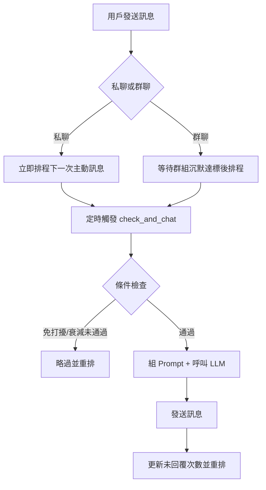
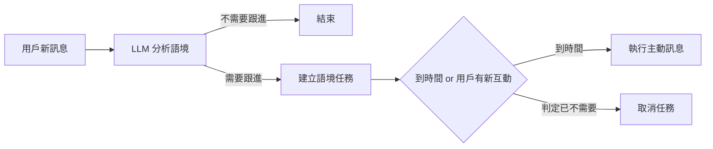

<!-- markdownlint-disable MD033 -->
<!-- markdownlint-disable MD041 -->

<div align="center">

# 🤖 AstrBot 主動訊息插件 (Plus Fork)

讓你的 Bot 不再只是被動回覆，而是能主動找人聊天。

繁體中文 | [English](README_EN.md) | [日本語](README_JP.md)

</div>

<p align="center">
  
  
  
</p>

<p align="center">
  
</p>

---

一個為 [AstrBot](https://github.com/AstrBotDevs/AstrBot) 設計的主動訊息插件。  
Bot 會在會話沉默後主動開話題，並可依時段、語境、未回覆次數動態調整策略。

## 版本資訊

目前版本：`v2.19.1`

最近更新：

- 新增插件自己的 SQLite 狀態庫 `proactive_state.db`，任務狀態不再依賴 AstrBot 核心資料庫
- 修復建立、改期、刪除與語境取消任務時的保存順序，避免保存失敗或重啟後任務消失/復活
- 任務頁新增指定會話 ID 篩選，改期彈窗會預設帶入目前任務時間，描述欄提示更清楚
- `requirements.txt` 已為 APScheduler、aiofiles、aiosqlite 加上大版本上限，降低未來依賴破壞 API 的風險
- 修復自動觸發與群聊沉默等待任務重啟後可能消失、或只剩頁面資料但沒有實際計時器的問題
- 重啟時若一般排程、語境任務或等待計時器剛錯過觸發時間，會在 30 分鐘寬限內補跑
- 任務頁「改期」改成彈窗操作，可在彈窗內選擇延遲分鐘或指定時間，並同步修改描述
- 任務頁可刪除或修改從 DB 還原出來的等待任務，不需要記憶體 timer 還存在
- `requirements.txt` 明確加入 `aiosqlite>=0.20.0,<1`
- 修復重啟後語境預測任務只顯示在頁面、但沒有重新掛回排程器導致逾時不發送的問題
- 預設不再把主動訊息寫回 AstrBot 主對話歷史，降低與一般聊天同時寫 SQLite 時出現 `database is locked` 的機率；需要時可在 `history_settings` 手動開啟安全寫回
- 任務頁改成參考 livingmemory 的 AstrBot Pages 管理介面風格，加入左側導覽、主題切換與更清楚的任務表格
- 任務頁支援新增、修改與清空任務描述，手動排程描述會提供給主動訊息生成使用
- 自動觸發與群聊沉默任務的描述現在也會提供給主動訊息生成使用
- 重做 AstrBot Pages 任務頁 UI，改善摘要、篩選、建立任務與任務列表的可讀性
- 任務頁新增會話欄位提示與空狀態處理，沒有啟用會話時會明確顯示原因
- AstrBot Pages 任務儀表板可查看、過濾、建立、改期、立即檢查與刪除任務
- 加強 livingmemory 長期記憶整合，會對齊 persona/session 過濾設定
- `decay_rate` 預設改為留空，代表不衰減、每次都允許觸發
- 白名單提示補充 Telegram 使用方式，QQ 與 Telegram 會話 ID 都可配置

## 🚀 快速上手

1. 下載本倉庫 `.zip`，在 AstrBot WebUI 選擇「從檔案安裝」
2. 進入插件配置，先設定一個目標會話（私聊或群聊）
3. 填入 `proactive_prompt`（你希望 Bot 主動聊什麼）
4. 設定排程（建議先用預設值），儲存後開始運作

> 想先驗證是否正常：啟動後觀察日誌是否出現主動訊息排程建立與觸發記錄。

## ✨ 你會得到什麼

- **主動開話題**：不只被動回覆，會在沉默後主動聊天
- **私聊 / 群聊分離**：兩種場景可獨立配置策略
- **更像真人**：可選未回覆衰減、分段發送、可搭配 TTS
- **語境感知**：可根據用戶訊息推測最佳跟進時間
- **可持久化**：重啟後可恢復排程狀態
- **可擴充記憶**：可選整合 [livingmemory](https://github.com/lxfight-s-Astrbot-Plugins/astrbot_plugin_livingmemory)
- **任務管理儀表板**：可在 AstrBot WebUI 查看、過濾、建立、改期、立即檢查與刪除任務

## 🔄 運作流程



### 語境任務流程



## ⚙️ 配置說明（先看這幾個）

### 1) 必填核心

| 配置項 | 用途 |
| :--- | :--- |
| `enable` | 啟用或停用該會話 |
| `proactive_prompt` | 決定主動聊天風格與動機 |
| `schedule_settings` | 控制多久觸發、是否衰減、免打擾時段 |

### 2) 進階能力

| 配置項 | 用途 |
| :--- | :--- |
| `context_aware_settings` | 依語境預測跟進時機 |
| `history_settings` | 控制是否把主動訊息寫回 AstrBot 主對話歷史 |
| `segmented_reply_settings` | 長訊息切段發送 |
| `tts_settings` | 啟用語音輸出 |

### 3) Prompt 佔位符

| 佔位符 | 說明 |
| :--- | :--- |
| `{{current_time}}` | 當前時間 |
| `{{unanswered_count}}` | 連續未被回覆次數 |
| `{{last_reply_time}}` | 使用者上次回覆時間（含經過時長） |

### 4) `schedule_rules` 一句話理解

- `interval_weights`：決定「等多久再發」
- `decay_rate`：決定「這次要不要發」
- 兩者一起用，就能做出更自然的主動聊天節奏

`decay_rate` 留空時代表不衰減，也就是每次排程到點都允許觸發。填 `"0"` 代表觸發概率為 0，因此到點檢查時不會發送；任務仍會依排程檢查並重排。

### 5) livingmemory 長期記憶

若已安裝 `astrbot_plugin_livingmemory`，可在語境感知設定中啟用長期記憶。插件會在主動訊息生成前檢索相關記憶，並遵守 livingmemory 目前的 session/persona 過濾設定。

未安裝 livingmemory 時會自動跳過，不影響主動訊息功能。

### 6) AstrBot 主對話歷史寫回

`history_settings.save_proactive_history` 預設為關閉。原因是主動排程與一般聊天可能同時寫入 AstrBot 主 SQLite 對話資料庫，容易放大 `database is locked` 的機率。

關閉時只是不把本次主動 prompt/回覆追加到 AstrBot 主對話歷史；主動訊息發送、任務排程、未回覆計數與 livingmemory 記憶檢索都不受影響。

若你確定需要在 AstrBot 主歷史中保留主動訊息，可開啟此項。開啟後插件會延遲寫入並在 SQLite 忙碌時重試；仍忙碌時會跳過本次寫回，避免影響聊天流程。

### 7) 任務狀態保存

插件會把最新任務狀態保存到自己的 `proactive_state.db`，包含一般排程、語境任務、自動觸發等待、群聊沉默等待、任務描述與未回覆計數。

升級時若 `proactive_state.db` 還沒有資料，插件會讀取一次舊的 `session_data.json` 並寫入新 DB；之後保留最新狀態即可，不會建立額外遷移檔。

這樣做可以避免任務狀態和 AstrBot 核心對話資料庫互相搶寫，也能降低重啟後任務消失的風險。

## 📊 Web 任務管理儀表板

在 AstrBot WebUI 的插件頁開啟本插件 Pages，即可查看目前任務：

- 一般主動訊息排程
- 語境感知跟進任務
- 建立手動排程並填寫任務描述
- 直接在列表修改或清空任務描述
- 自動觸發任務
- 群組沉默等待任務

儀表板提供任務數量摘要、搜尋、任務類型篩選、私聊/群聊篩選、啟用狀態篩選、手動刷新與自動刷新，方便確認 Bot 目前還會在什麼時間主動發訊息。

也可以直接在頁面操作任務：

- 對已配置且啟用的會話建立一次新的主動訊息排程
- 修改一般排程與語境任務的執行時間；按「改期」會開啟彈窗，可選延遲分鐘或指定時間，並同步修改任務描述
- 自動觸發/群組沉默等待任務改期時會轉成手動排程
- 立即檢查指定會話是否符合主動訊息發送條件
- 刪除不需要的等待任務

## 💬 聊天指令

在聊天中輸入以下指令即可與插件互動：

| 指令 | 說明 |
| :--- | :--- |
| `/proactive help` | 顯示可用指令列表 |
| `/proactive tasks` | 列出當前所有待執行的主動訊息排程任務（含一般排程、語境預測任務） |

## 📁 配置結構（概念）

```
├─ private_settings    # 私聊全域預設
├─ group_settings      # 群聊全域預設
├─ private_sessions    # 私聊個別覆蓋
└─ group_sessions      # 群聊個別覆蓋
```

## 📁 專案結構

```
astrbot_plugin_proactive_chat_plus/
├── main.py                    # 插件入口：生命週期、事件處理、核心調度
├── core/
│   ├── __init__.py            # 模組匯出
│   ├── utils.py               # 通用工具（免打擾判斷、UMO 解析、日誌格式化）
│   ├── config.py              # 配置管理（驗證、會話配置查詢、備份）
│   ├── scheduler.py           # 排程邏輯（加權隨機間隔、時段規則、衰減判定）
│   ├── context_predictor.py   # 語境感知（LLM 預測時機、任務取消判斷）
│   ├── messaging.py           # 訊息發送（裝飾鉤子、分段回覆、歷史清洗）
│   ├── llm_helpers.py         # LLM 輔助（請求準備、記憶檢索整合、LLM 呼叫封裝）
│   ├── send.py                # 主動訊息發送（TTS / 文字 / 分段發送）
│   ├── context_scheduling.py  # 語境感知排程（LLM 預測排程、任務建立/取消/恢復）
│   ├── page_api.py            # AstrBot Pages API（任務狀態、任務列表與任務操作）
│   ├── state_store.py         # 插件 SQLite 狀態庫（保存最新 session_data）
│   ├── chat_executor.py       # 核心執行（check_and_chat 流程、Prompt 構造、收尾）
│   └── prompts/               # LLM Prompt 模板（語境預測、任務取消判斷）
├── pages/
│   └── dashboard/             # AstrBot Pages 任務管理儀表板
├── _conf_schema.json          # WebUI 配置結構定義
├── metadata.yaml              # 插件元資料
├── requirements.txt           # 依賴列表
├── CHANGELOG.md               # 更新日誌
└── LICENSE                    # AGPL-3.0
```

## 🙏 致謝原作者

本專案基於 [DBJD-CR/astrbot_plugin_proactive_chat](https://github.com/DBJD-CR/astrbot_plugin_proactive_chat) 修改，感謝原作者與協作者。

## 🌐 平台適配

| 平台 | 支援情況 |
| :--- | :--- |
| QQ 個人號 (aiocqhttp) | ✅ 完整支援 |
| Telegram | ✅ 完整支援 |
| 飛書 | ❓ 理論支援（未測試） |

## 📄 授權

GNU Affero General Public License v3.0 — 詳見 [LICENSE](LICENSE)。

## 💖 相關連結

- 原專案：[DBJD-CR/astrbot_plugin_proactive_chat](https://github.com/DBJD-CR/astrbot_plugin_proactive_chat)
- AstrBot：[AstrBotDevs/AstrBot](https://github.com/AstrBotDevs/AstrBot)
