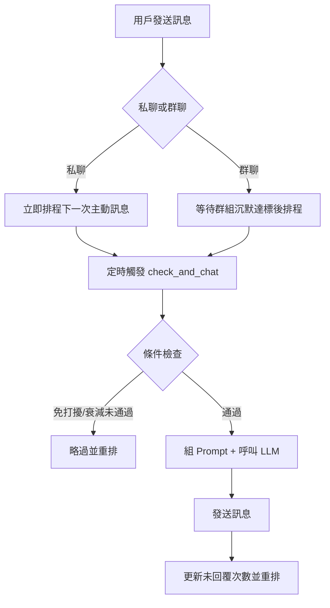
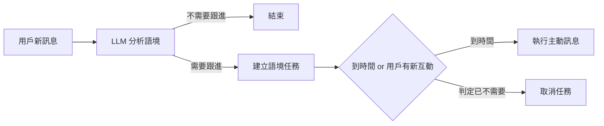

<!-- markdownlint-disable MD033 -->
<!-- markdownlint-disable MD041 -->

<div align="center">

# 🤖 AstrBot 主動訊息插件 (Plus Fork)

讓你的 Bot 不再只是被動回覆，而是能主動找人聊天。

繁體中文 | [English](README_EN.md) | [日本語](README_JP.md)

</div>

<p align="center">
  
  
  
</p>

<p align="center">
  
</p>

---

一個為 [AstrBot](https://github.com/AstrBotDevs/AstrBot) 設計的主動訊息插件。  
Bot 會在會話沉默後主動開話題，並可依時段、語境、未回覆次數動態調整策略。

## 🚀 快速上手

1. 下載本倉庫 `.zip`，在 AstrBot WebUI 選擇「從檔案安裝」
2. 進入插件配置，先設定一個目標會話（私聊或群聊）
3. 填入 `proactive_prompt`（你希望 Bot 主動聊什麼）
4. 設定排程（建議先用預設值），儲存後開始運作

> 想先驗證是否正常：啟動後觀察日誌是否出現主動訊息排程建立與觸發記錄。

## ✨ 你會得到什麼

- **主動開話題**：不只被動回覆，會在沉默後主動聊天
- **私聊 / 群聊分離**：兩種場景可獨立配置策略
- **更像真人**：未回覆時自動衰減、分段發送、可搭配 TTS
- **語境感知**：可根據用戶訊息推測最佳跟進時間
- **可持久化**：重啟後可恢復排程狀態
- **可擴充記憶**：可選整合 [livingmemory](https://github.com/lxfight-s-Astrbot-Plugins/astrbot_plugin_livingmemory)

## 🔄 運作流程



### 語境任務流程



## ⚙️ 配置說明（先看這幾個）

### 1) 必填核心

| 配置項 | 用途 |
| :--- | :--- |
| `enable` | 啟用或停用該會話 |
| `proactive_prompt` | 決定主動聊天風格與動機 |
| `schedule_settings` | 控制多久觸發、是否衰減、免打擾時段 |

### 2) 進階能力

| 配置項 | 用途 |
| :--- | :--- |
| `context_aware_settings` | 依語境預測跟進時機 |
| `segmented_reply_settings` | 長訊息切段發送 |
| `tts_settings` | 啟用語音輸出 |

### 3) Prompt 佔位符

| 佔位符 | 說明 |
| :--- | :--- |
| `{{current_time}}` | 當前時間 |
| `{{unanswered_count}}` | 連續未被回覆次數 |
| `{{last_reply_time}}` | 使用者上次回覆時間（含經過時長） |

### 4) `schedule_rules` 一句話理解

- `interval_weights`：決定「等多久再發」
- `decay_rate`：決定「這次要不要發」
- 兩者一起用，就能做出更自然的主動聊天節奏

## 💬 聊天指令

在聊天中輸入以下指令即可與插件互動：

| 指令 | 說明 |
| :--- | :--- |
| `/proactive help` | 顯示可用指令列表 |
| `/proactive tasks` | 列出當前所有待執行的主動訊息排程任務（含一般排程、語境預測任務） |

## 📁 配置結構（概念）

```
├─ private_settings    # 私聊全域預設
├─ group_settings      # 群聊全域預設
├─ private_sessions    # 私聊個別覆蓋
└─ group_sessions      # 群聊個別覆蓋
```

## 📁 專案結構

```
astrbot_plugin_proactive_chat_plus/
├── main.py                    # 插件入口：生命週期、事件處理、核心調度
├── core/
│   ├── __init__.py            # 模組匯出
│   ├── utils.py               # 通用工具（免打擾判斷、UMO 解析、日誌格式化）
│   ├── config.py              # 配置管理（驗證、會話配置查詢、備份）
│   ├── scheduler.py           # 排程邏輯（加權隨機間隔、時段規則、衰減判定）
│   ├── context_predictor.py   # 語境感知（LLM 預測時機、任務取消判斷）
│   ├── messaging.py           # 訊息發送（裝飾鉤子、分段回覆、歷史清洗）
│   ├── llm_helpers.py         # LLM 輔助（請求準備、記憶檢索整合、LLM 呼叫封裝）
│   ├── send.py                # 主動訊息發送（TTS / 文字 / 分段發送）
│   ├── context_scheduling.py  # 語境感知排程（LLM 預測排程、任務建立/取消/恢復）
│   ├── chat_executor.py       # 核心執行（check_and_chat 流程、Prompt 構造、收尾）
│   └── prompts/               # LLM Prompt 模板（語境預測、任務取消判斷）
├── _conf_schema.json          # WebUI 配置結構定義
├── metadata.yaml              # 插件元資料
├── requirements.txt           # 依賴列表
├── CHANGELOG.md               # 更新日誌
└── LICENSE                    # AGPL-3.0
```

## 🙏 致謝原作者

本專案基於 [DBJD-CR/astrbot_plugin_proactive_chat](https://github.com/DBJD-CR/astrbot_plugin_proactive_chat) 修改，感謝原作者與協作者。

## 🌐 平台適配

| 平台 | 支援情況 |
| :--- | :--- |
| QQ 個人號 (aiocqhttp) | ✅ 完整支援 |
| Telegram | ✅ 完整支援 |
| 飛書 | ❓ 理論支援（未測試） |

## 📄 授權

GNU Affero General Public License v3.0 — 詳見 [LICENSE](LICENSE)。

## 💖 相關連結

- 原專案：[DBJD-CR/astrbot_plugin_proactive_chat](https://github.com/DBJD-CR/astrbot_plugin_proactive_chat)
- AstrBot：[AstrBotDevs/AstrBot](https://github.com/AstrBotDevs/AstrBot)
